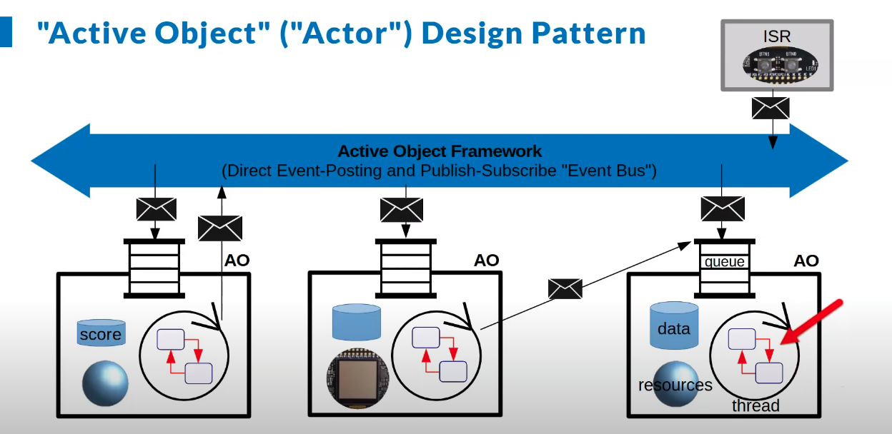

# Event-Driven Development Framework

This framework is created for applications where everything has been created based on events. It is still in development and can be considered as a toy framework until the important stuff has been done.

it is inspired by QP Framework, which provides highly modern and reliable Real-time Embedded Framework. You will find a similar implementation from QP in this repo.

# Software Architecture Scheme

